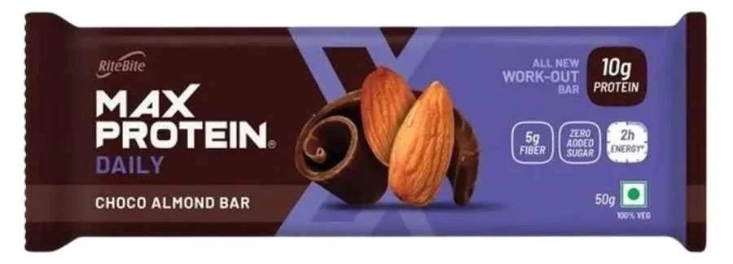
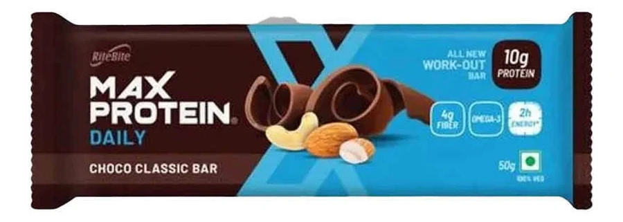
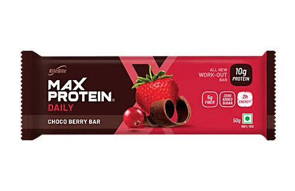
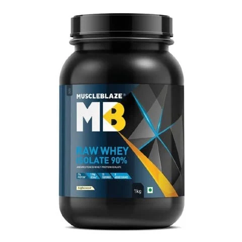
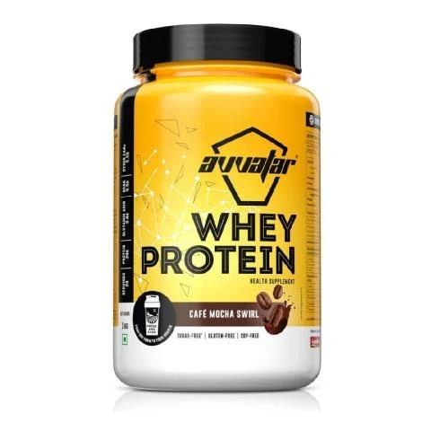
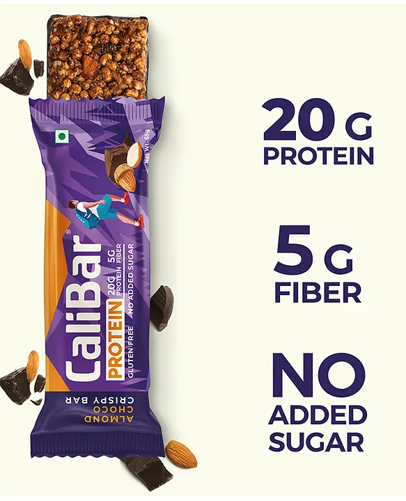
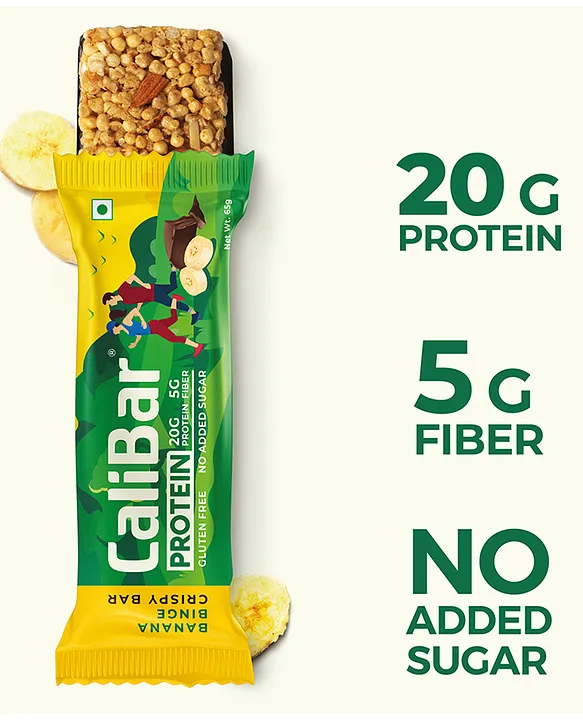
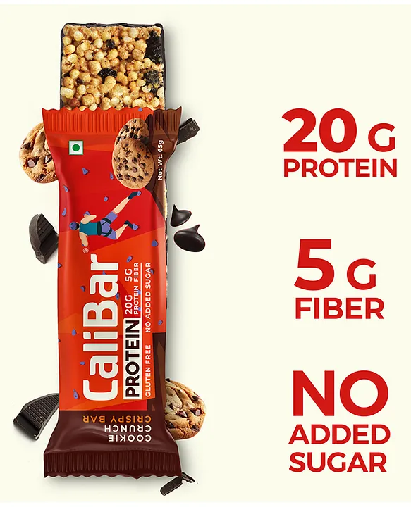

web link: http://127.0.0.1:3000/index.html?vscode-livepreview=true
<!DOCTYPE html>
<html lang="en">

<head>
    <meta charset="UTF-8">
    <meta name="viewport" content="width=device-width, initial-scale=1.0">
    <title>Bootstrap Responsive Website</title>

    <!-- Bootstrap CSS -->
    <link href="https://cdn.jsdelivr.net/npm/bootstrap@5.3.3/dist/css/bootstrap.min.css" rel="stylesheet">

    <!-- Custom CSS -->
    <link rel="stylesheet" href="style.css">
</head>

<body>

    <!-- Navbar -->
    <nav class="navbar navbar-expand-lg navbar-dark bg-dark">
        

            <a class="navbar-brand" href="#">TANGO PROTEIN</a>

            <button class="navbar-toggler" type="button" data-bs-toggle="collapse" data-bs-target="#navbarNav">
                
            </button>

            

                <ul class="navbar-nav ms-auto">
                    <li class="nav-item">
                        <a class="nav-link active" href="#">T Protein bars</a>
                    </li>

                    <li class="nav-item">
                        <a class="nav-link" href="#">T Protein Powder</a>
                    </li>

                    <li class="nav-item">
                        <a class="nav-link" href="#">T Protein Chocolatss</a>
                    </li>

                </ul>
            

        

    </nav>

    <!-- Carousel -->
    

        

            

                
            

            

                
            

            

                
            

        

        <button class="carousel-control-prev" type="button" data-bs-target="#carouselExample" data-bs-slide="prev">
            
        </button>

        <button class="carousel-control-next" type="button" data-bs-target="#carouselExample" data-bs-slide="next">
            
        </button>

    

    <!-- Grid System and Cards -->
    

        

            <!-- Card 1 -->
            

                

                    

                    

                        <h5 class="card-title">Protein Powder</h5>

                        

                            Pure Protein. Pure Performance.
                        

                        <a href="#" class="btn btn-primary">Tap To Order</a>
                    

                

            

            <!-- Card 2 -->
            

                

                    

                    

                        <h5 class="card-title">Protein Powder</h5>

                        

                            Premium Protein for Peak Performance.
                        

                        <a href="#" class="btn btn-success">Tap To Order</a>
                    

                

            

            <!-- Card 3 -->
            

                

                    

                    

                        <h5 class="card-title">Protein Powder</h5>

                        

                            From First Workout to Personal Best—We've Got Your Protein Covered.
                        

                        <a href="#" class="btn btn-danger">Tap To Order</a>
                    

                

            

        

    

    <!-- Grid System and Cards -->
    

        

            <!-- Card 1 -->
            

                

                    

                    

                        <h5 class="card-title">Protein Chocolates</h5>

                        

                            Enjoy the rich taste of chocolate while fueling your muscles with high-quality protein.
                        

                        <a href="#" class="btn btn-primary">Tap To Order</a>
                    

                

            

            <!-- Card 2 -->
            

                

                    

                    

                        <h5 class="card-title">Protein Chocolates</h5>

                        

                            Deliciously smooth, packed with protein, and made to support your fitness journey.
                        

                        <a href="#" class="btn btn-success">Tap To Order</a>
                    

                

            

            <!-- Card 3 -->
            

                

                    

                    

                        <h5 class="card-title">Protein Chocolates</h5>

                        

                            Enjoy delicious protein-rich chocolates for a tasty treat.
                        

                        <a href="#" class="btn btn-danger">Tap To Order</a>
                    

                

            

        

    

    <!-- Footer -->
    <footer class="bg-dark text-white text-center p-3 mt-5">
        
© TANGO PROTEIN 

    </footer>

    <!-- Bootstrap JS -->
    

</body>

</html>>>
